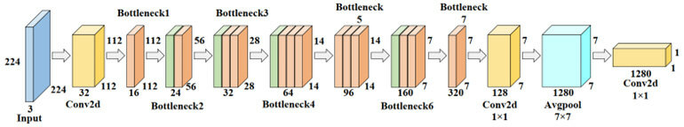

# **KLASIFIKASI JENIS IKAN MENGGUNAKAN MODEL INCEPTIONV3 DAN MOBILENETV2**

## 📖 **OVERVIEW PROJECT**
Tujuan dari pembuatan proyek ini adalah untuk mengembangkan sistem yang dapat mempermudah dan mempercepat proses identifikasi jenis ikan pada hasil tambak, guna meningkatkan efisiensi dan kualitas pengelolaan tambak secara keseluruhan. Pengelolaan hasil tambak sering menghadapi tantangan dalam menyortir jenis ikan secara cepat dan akurat, terutama ketika beragam spesies seperti Black Sea Sprat, Gilt-Head Bream, Horse Mackerel, Red Mullet, Red Sea Bream, Sea Bass, Shrimp, Striped Red Mullet, dan Trout harus diidentifikasi. Tantangan ini dapat menyebabkan penurunan efisiensi dan kualitas produk jika dilakukan secara manual. Untuk mengatasi masalah tersebut, teknologi berbasis pengolahan citra hadir sebagai solusi yang memungkinkan identifikasi dan penyortiran ikan secara otomatis. Teknologi ini tidak hanya meningkatkan efisiensi pengelolaan tambak, tetapi juga memastikan kualitas produk sesuai standar pasar, sekaligus mempermudah proses distribusi dan mendukung keberlanjutan usaha tambak.

📂 Link Dataset yang digunakan: [A Large Scale Fish Dataset](https://www.kaggle.com/datasets/crowww/a-large-scale-fish-dataset/data). 

---

## 🔧 **PREPROCESSING**
Proses preprocessing bertujuan untuk mempersiapkan dataset gambar agar siap digunakan dalam pelatihan model machine learning. Tahapan preprocessing meliputi:
1. **Resize**: Gambar diubah ukurannya menjadi 224x224 piksel.
2. **Normalization**: Nilai piksel dinormalisasi untuk mempercepat konvergensi model.
3. **Augmentation**: Teknik augmentasi seperti rotasi, flip, zoom, translasi, penyesuaian brightness, dan contrast diterapkan untuk memperkaya dataset.

Dataset dibagi menjadi tiga set utama:
- **Train**: 70% digunakan untuk melatih model.
- **Validation**: 20% digunakan untuk memantau kinerja model selama pelatihan.
- **Test**: 10% digunakan untuk mengevaluasi model setelah pelatihan.

---

## 🧠 **MODEL**

### **1. InceptionV3**

- **Pengertian Umum**: InceptionV3 adalah salah satu model deep learning yang populer untuk tugas klasifikasi citra. Model ini dirancang dengan arsitektur mendalam yang menggunakan modul Inception untuk menangkap informasi visual dengan efisien melalui berbagai ukuran filter. InceptionV3 dioptimalkan untuk memberikan akurasi tinggi pada dataset besar sambil tetap menjaga efisiensi komputasi.
- **Hasil Pelatihan**:
  - Akurasi pelatihan: **87.47%** (epoch ke-20)
  - Akurasi validasi: **99.00%**

### **2. MobileNetV2**

- **Pengertian Umum**: MobileNetV2 adalah model deep learning yang dirancang untuk perangkat dengan daya komputasi rendah, seperti ponsel dan perangkat IoT. Model ini menggunakan blok inverted residuals dan depthwise separable convolution untuk meningkatkan efisiensi tanpa mengorbankan akurasi. MobileNetV2 sangat cocok untuk aplikasi real-time dengan latensi rendah.
- **Hasil Pelatihan**:
  - Akurasi pelatihan: **87.59%** (epoch ke-20)
  - Akurasi validasi: **99.33%**

---

## 📃 **DEPENDENSI & LANGKAH INSTALASI**

### **Dependensi yang Dibutuhkan**
- `tensorflow>=2.18.0`
- `joblib>=1.4.2`
- `scikit-learn>=1.6.0`
- `streamlit>=1.41.1`

### **Langkah Instalasi TensorFlow Menggunakan PDM**
1. **Pastikan berada di dalam direktori virtual environment `.venv`:**
    ```bash
    pdm info
    ```
2. **Periksa apakah TensorFlow sudah terinstal dalam virtual environment:**
    ```bash
    pdm run python -m pip show tensorflow
    ```
3. **Jika belum terinstal, jalankan perintah berikut untuk menginstal TensorFlow:**
    ```bash
    pdm run python -m ensurepip --upgrade
    pdm run python -m pip install tensorflow
    ```
4. **Verifikasi instalasi dengan memeriksa versi TensorFlow:**
    ```bash
    pdm run python -c "import tensorflow as tf; print(tf.version)"
    ```

### **Struktur File Proyek**
- `app.py`: Berkas aplikasi utama yang berisi rute dan fungsi.
- `klasifikasi_citra.py`: Berkas penerapan dari model untuk klasifikasi dan tampilan antarmuka web.

### **Menjalankan Aplikasi**
- Jalankan aplikasi dengan perintah berikut:
    ```bash
    streamlit run ./src/app.py
    ```
- Akses aplikasi melalui peramban web di alamat: [http://localhost:8501/](http://localhost:8501/)

---

## 📊 **EVALUASI MODEL**

### Evaluasi Model: InceptionV3

#### Hasil Grafik Pelatihan


Pada proses pelatihan model menggunakan InceptionV3, dimulai dengan menggunakan model yang telah dilatih sebelumnya (pre-trained model) dan melakukan fine-tuning pada dataset khusus. Selama pelatihan, model mengalami peningkatan performa yang signifikan seiring berjalannya waktu. Pada epoch pertama, akurasi model pada data pelatihan tercatat sekitar 35.72%, sementara pada data validasi, akurasi mencapai 90.50%. Meskipun akurasi pada data pelatihan masih rendah, model telah menunjukkan kemampuan yang sangat baik untuk memprediksi data yang belum pernah dilihat sebelumnya (data validasi). Seiring berjalannya pelatihan, akurasi pada data pelatihan terus meningkat, mencapai sekitar 87.47% pada epoch ke-20. Pada saat yang sama, model menunjukkan kinerja yang sangat baik pada data validasi, dengan akurasi mencapai 99.00%. Hal ini menunjukkan bahwa model tidak hanya belajar dari data pelatihan, tetapi juga mampu menggeneralisasi dengan sangat baik terhadap data yang belum pernah dilihat sebelumnya. Meskipun terdapat beberapa fluktuasi kecil dalam nilai akurasi dan loss di antara epoch-epoch tertentu, secara keseluruhan, model mengalami peningkatan yang konsisten.

#### Hasil Classification Report


Hasil dari classification report memberikan gambaran menyeluruh tentang performa model klasifikasi pada dataset yang diuji. Dalam laporan ini, terdapat beberapa metrik evaluasi yang penting, yaitu precision, recall, dan f1-score, yang dihitung untuk setiap kelas. Precision mengukur ketepatan prediksi positif yang dilakukan oleh model, yaitu seberapa banyak prediksi yang benar dari seluruh prediksi yang dikategorikan sebagai kelas tersebut. Recall mengukur kemampuan model dalam mendeteksi kelas tersebut, yaitu seberapa banyak data yang sebenarnya termasuk dalam kelas tersebut dapat ditemukan oleh model. F1-score adalah rata-rata harmonik dari precision dan recall, memberikan gambaran umum seberapa baik model secara keseluruhan.
Kita dapat melihat bahwa sebagian besar kelas memiliki performa yang sangat baik dengan precision, recall, dan f1-score mendekati 1 (nilai terbaik), seperti untuk kelas "Black Sea Sprat", "Shrimp", dan "Trout" yang menunjukkan skor 1.00 untuk ketiga metrik. Hanya kelas "Striped Red Mullet" yang menunjukkan sedikit penurunan pada recall dengan skor 0.94, meskipun precision dan f1-score tetap tinggi. Secara keseluruhan, model ini menunjukkan performa yang luar biasa dengan akurasi 99% pada dataset pengujian, yang berarti model dapat dengan sangat baik membedakan antara kelas-kelas yang ada dalam data. Macro avg dan weighted avg menunjukkan bahwa model secara konsisten memberikan hasil yang seimbang dan berkinerja baik di semua kelas, dengan skor rata-rata hampir mencapai 1.00.

#### Hasil Confusion Matrix


Confusion matrix yang diberikan menggambarkan performa model dalam mengklasifikasikan 9 jenis ikan. Secara keseluruhan, model ini menunjukkan performa yang sangat baik, dengan akurasi yang tinggi dan jumlah kesalahan yang sangat sedikit. Untuk kelas "Black Sea Sprat", model berhasil mengklasifikasikan semua 100 sampel dengan benar. Begitu juga dengan kelas "Hourse Mackerel", "Red Mullet", "Red Sea Bream", "Shrimp", dan "Trout", di mana model berhasil mengklasifikasikan semua sampel tanpa ada kesalahan. Pada kelas "Gilt-Head Bream", model hanya salah mengklasifikasikan 1 sampel yang seharusnya termasuk dalam kelas ini, tetapi malah masuk ke dalam kelas "Red Mullet". Untuk kelas "Sea Bass", 2 sampel salah diklasifikasikan sebagai "Shrimp".
Kelas "Striped Red Mullet" menunjukkan sedikit penurunan performa dengan 3 sampel yang salah diklasifikasikan sebagai "Gilt-Head Bream" dan 3 sampel lagi yang salah diklasifikasikan sebagai "Red Mullet". Namun, meskipun ada beberapa kesalahan ini, model tetap menunjukkan hasil yang sangat baik secara keseluruhan, dengan tingkat akurasi yang sangat tinggi dan hanya sedikit kesalahan dalam pengklasifikasian. Hasil ini menandakan bahwa model dapat dengan efektif membedakan berbagai jenis ikan dengan performa yang konsisten dan akurat.

---

### Evaluasi Model: MobileNetV2

#### Hasil Grafik Pelatihan


Pada proses pelatihan model dengan MobileNetV2, model memulai dengan performa yang moderat pada epoch pertama, dengan akurasi pelatihan sekitar 38.92% dan akurasi validasi mencapai 96.67%. Hal ini menunjukkan bahwa meskipun model mulai belajar, ia sudah mampu memprediksi data validasi dengan cukup baik sejak awal. Pada epoch kedua, akurasi pelatihan meningkat pesat menjadi 71.33%, dan akurasi validasi terus meningkat menjadi 97.94%. Peningkatan ini berlanjut stabil sepanjang proses pelatihan.
Pada epoch ke-5, model menunjukkan akurasi pelatihan sebesar 82.26% dengan akurasi validasi yang masih tinggi, yaitu 98.28%. Puncaknya terjadi pada epoch ke-12, di mana akurasi pelatihan mencapai 87.09% dan akurasi validasi tercatat pada 99.39%. Meskipun ada beberapa fluktuasi kecil pada akurasi dan loss di beberapa epoch berikutnya, model tetap menunjukkan kemampuan generalisasi yang sangat baik pada data validasi. Pada akhir pelatihan (epoch ke-20), akurasi pelatihan mencapai 87.59% dengan akurasi validasi yang stabil di 99.33%. Secara keseluruhan, meskipun terdapat fluktuasi minor, model menunjukkan peningkatan yang konsisten dalam hal akurasi pelatihan dan validasi.

#### Hasil Classification Report


Hasil dari classification report menunjukkan bahwa model klasifikasi memiliki kinerja yang sangat baik pada dataset yang diuji. Sebagian besar kelas menunjukkan precision, recall, dan f1-score yang mendekati 1.00, menunjukkan prediksi yang sangat akurat dan kemampuan model untuk mendeteksi kelas dengan baik. Kelas seperti "Black Sea Sprat", "Shrimp", dan "Trout" memiliki skor 1.00 pada ketiga metrik, sementara kelas lainnya, seperti "Gilt-Head Bream", "Horse Mackerel", dan "Red Sea Bream", juga menunjukkan performa yang sangat baik dengan skor hampir 1.00 di semua metrik.
Meskipun sebagian besar kelas memiliki hasil yang luar biasa, ada beberapa kelas yang sedikit menurun pada recall, seperti pada "Sea Bass" dengan skor 0.97, dan "Striped Red Mullet" dengan skor 0.94, meskipun precision dan f1-score tetap tinggi. Secara keseluruhan, model ini mencapai akurasi 99% pada dataset pengujian, yang menunjukkan kemampuan model untuk membedakan kelas-kelas dengan sangat baik.

#### Hasil Confusion Matrix


Secara spesifik, model menunjukkan kinerja yang sangat baik pada setiap kelas. Misalnya, untuk kelas "Black Sea Sprat" dan "Gilt-Head Bream", model berhasil mengklasifikasikan 99 dari 100 sampel dengan benar, dengan hanya 1 kesalahan pada setiap kelas. Kelas lain seperti "Hourse Mackerel", "Red Sea Bream", "Shrimp", "Trout", dan "Striped Red Mullet" juga menunjukkan hasil yang sangat baik, dengan hampir semua sampel diklasifikasikan dengan benar. Namun, kelas "Sea Bass" memiliki sedikit lebih banyak kesalahan, dengan 3 misclassifications, yaitu 2 sebagai "Black Sea Sprat" dan 1 sebagai "Shrimp". Meskipun demikian, kesalahan ini tidak mengurangi kinerja keseluruhan model yang masih sangat efektif dalam membedakan setiap kelas dengan akurasi yang tinggi.

---

## 🌐 **LOCAL DEPLOYMENT**
Aplikasi ini dilengkapi dengan antarmuka lokal untuk memprediksi jenis ikan berdasarkan input gambar.  
**Tampilan Utama**:

**Input gambar ikan**:

**Hasil prediksi jenis ikan ditampilkan**:


---

## 🚀 **Cara Menjalankan**
1. Clone repositori ini:
   ```bash
   git clone https://github.com/miftahulputra/UAP_MACHINE_LEARNING.git
